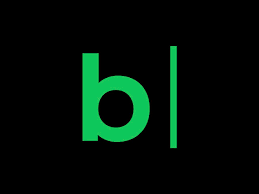
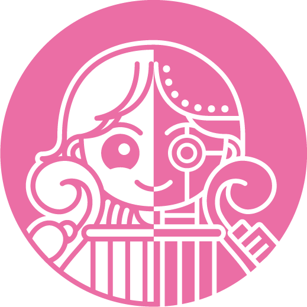

<div align="center">
  

  <br>

<div align="center">
  <br><br><br><br>
  <a href="https://git.io/typing-svg">
    
  </a>

  <br><br><br><br>

  <div align="center">
    <a href="https://www.instagram.com/2taeyeop/">
      
    </a>
    &nbsp;&nbsp;&nbsp;
    <a href="mailto:xoduq020827@gmail.com">
      
    </a>
    &nbsp;&nbsp;&nbsp;
    <a href="https://blog.naver.com/2taeyeop">
      
    </a>
  </div>
</div>

<br><br>

## Tech Stacks

#### Frontend
<p>
  
</p>

#### Backend
<p>
  
</p>

#### DevOps / Infra
<p>
  
</p>

#### Etc
<p>
  
</p>

<br>

## Projects

<table width="100%">
  <tr>
    <td width="32%" valign="top">

###  디스이즈 - DSIS

**개발 팀장**  
**`2022.09 ~ 진행중`**

> 대학교 학생을 위한 필수 정보 앱

---

**Tech Stack**


---

**Links**

📂 [GitHub](https://github.com/DSIS-Android/DSIS-summary)  
📲 [Google Play](https://play.google.com/store/apps/details?id=kr.co.thisis.dsisproject)  
🍎 [App Store](https://apps.apple.com/kr/app/디스이즈/id1550249063)

<p>&nbsp;</p>

   </td>
    <td width="68%" valign="middle">

**Key Contributions**

- **개발 리딩** — 팀원 코드 리뷰, 개발 일정·이슈 관리, 기술 의사결정 주도
- **앱 개발** — React Native 기반 크로스플랫폼 컴포넌트 제작 및 네이티브 연동
- **웹뷰 연동** — React 기반 웹뷰 호환 사이트 제작으로 앱·웹 콘텐츠 통합
- **구조 개선** — 컴포넌트 분리·재사용성 개선, React Native → React 마이그레이션 주도
- **반응형 구현** — 다양한 디바이스(모바일·태블릿) 대응 UI 설계
- **배포 & 인프라** — AWS·Docker·NGINX 기반 FE·BE 배포 및 CI/CD 파이프라인 구축
- **스토어 배포** — Google Play · App Store 정식 출시 및 업데이트 운영

   </td>
  </tr>
</table>

<br>

<table width="100%">
  <tr>
    <td width="32%" valign="top">

###  Muzig.ai

**Front-End**  
**`2025.09 ~ 진행중`**

> AI 음악 생성 사이트

---

**Tech Stack**


---

**Links**

🌐 [muzig.ai](https://muzig.ai)

<p>&nbsp;</p>

   </td>
    <td width="68%" valign="middle">

**Key Contributions**

- **프로젝트 설계** — Next.js App Router 기반 프로젝트 구조 설계 및 라우팅·레이아웃 구성
- **로직 분리** — Custom Hooks 패턴 도입으로 UI와 비즈니스 로직(API 호출, 상태 관리) 분리
- **타입 안정성** — TypeScript 기반 인터페이스 설계로 런타임 에러 사전 방지
- **스타일링** — CSS Modules 기반의 스코프 격리 스타일링 시스템 구축
- **사용자 경험** — AI 음악 생성 흐름에 맞춘 로딩·피드백 UX 최적화
- **반응형 구현** — 모바일·데스크톱 대응 반응형 UI 설계
- **코드 품질** — 컴포넌트 재사용성 개선 및 지속적인 코드 리팩토링

   </td>
  </tr>
</table>

<br>

<table width="100%">
  <tr>
    <td width="32%" valign="top">

###  직직직

**Front-End**  
**`2025.09 ~ 진행중`**

> 현장을 위한 더 나은 인력 연결 플랫폼

---

**Tech Stack**


---

**Links**

🌐 [3jik.com](https://www.3jik.com/)

<p>&nbsp;</p>

   </td>
    <td width="68%" valign="middle">

**Key Contributions**

- **프로젝트 설계** — Vite + React + TypeScript 기반 프로젝트 구조 설계 및 개발
- **상태 관리** — 상태 관리 라이브러리(Recoil/Zustand/Redux) 도입 및 전역 상태 설계
- **로직 분리** — Custom Hooks 패턴 도입으로 UI와 비즈니스 로직(API 호출, 상태 관리) 분리
- **앱 개발** — React Native 기반 모바일 앱 개발 및 웹·앱 공통 로직 추출
- **반응형 구현** — 반응형 UI 구현 및 사용자 인터랙션 최적화
- **스토어 배포** — Google Play · App Store 런칭 및 심사 대응

   </td>
  </tr>
</table>

<br>

## Rewards

| 대회명                                                          | 수상일자  |      성과      |
| :-------------------------------------------------------------- | :-------: | :------------: |
| Korea StartUp Forum (KSF) 주최 2025 Project Root-B IR 피칭 대회 | `2025.09` |    **대상**    |
| 부산 RISE 창업경진대회                                          | `2025.09` |  **최우수상**  |
| ML 고객 페르소나 기반 시장 검증 및 창업 시뮬레이션 경진 대회    | `2025.11` | **대상 (1위)** |
| 멋쟁이사자처럼 애니멀리그 4월                                   | `2026.04` |    **1위**     |

<br>

## Experience & Activities

<table>
  <tr>
    <th width="35%">기간</th>
    <th width="40%">소속</th>
    <th width="25%">역할</th>
  </tr>
  <tr>
    <td align="center" nowrap><code>2026.02 ~ 현재</code></td>
    <td><b>멋쟁이 사자처럼 14기</b></td>
    <td align="center">FE 운영진</td>
  </tr>
  <tr>
    <td align="center" nowrap><code>2025.09 ~ 현재</code></td>
    <td><b>아티움 그룹 - Muzig.ai</b></td>
    <td align="center">계약직</td>
  </tr>
  <tr>
    <td align="center" nowrap><code>2024.02 ~ 현재</code></td>
    <td><b>디스이즈 (DSIS, This is)</b></td>
    <td align="center">개발 팀장</td>
  </tr>
  <tr>
    <td align="center" nowrap><code>2024.04 ~ 2024.11</code></td>
    <td><b>BITS (Busan IT Society)</b></td>
    <td align="center">운영진</td>
  </tr>
  <tr>
    <td align="center" nowrap><code>2024.03 ~ 2024.12</code></td>
    <td><b>창업 동아리 쓸모</b></td>
    <td align="center">앱 1인 개발</td>
  </tr>
  <tr>
    <td align="center" nowrap><code>2024.02 ~ 2024.06</code></td>
    <td><b>미래 내일 일 경험</b></td>
    <td align="center">인턴</td>
  </tr>
  <tr>
    <td align="center" nowrap><code>2023.03 ~ 2023.12</code></td>
    <td><b>GDG (Google Developer Group)</b></td>
    <td align="center">멤버</td>
  </tr>
  <tr>
    <td align="center" nowrap><code>2022.09 ~ 2024.01</code></td>
    <td><b>디스이즈 (DSIS, This is)</b></td>
    <td align="center">FE 팀원</td>
  </tr>
</table>

<br>

## GitHub Stats

<div align="center">
  
</div>

<br>
<details>
<summary><b>📊 Detailed Stats (Including Organization) </b> </summary>
### Detailed Stats (Including Organization)

<!--START_SECTION:waka-->


**🐱 My GitHub Data** 

> 📦 769 Bytes Used in GitHub's Storage 
 > 
> 🏆 1,137 Contributions in the Year 2026
 > 
> 🚫 Not Opted to Hire
 > 
> 📜 8 Public Repositories 
 > 
> 🔑 2 Private Repositories 
 > 
**I'm an Early 🐤** 

```text
🌞 Morning                2011 commits        ███████░░░░░░░░░░░░░░░░░░   27.62 % 
🌆 Daytime                4177 commits        ██████████████░░░░░░░░░░░   57.37 % 
🌃 Evening                897 commits         ███░░░░░░░░░░░░░░░░░░░░░░   12.32 % 
🌙 Night                  196 commits         █░░░░░░░░░░░░░░░░░░░░░░░░   02.69 % 
```
📅 **I'm Most Productive on Tuesday** 

```text
Monday                   1155 commits        ████░░░░░░░░░░░░░░░░░░░░░   15.86 % 
Tuesday                  1767 commits        ██████░░░░░░░░░░░░░░░░░░░   24.27 % 
Wednesday                1470 commits        █████░░░░░░░░░░░░░░░░░░░░   20.19 % 
Thursday                 1163 commits        ████░░░░░░░░░░░░░░░░░░░░░   15.97 % 
Friday                   1223 commits        ████░░░░░░░░░░░░░░░░░░░░░   16.80 % 
Saturday                 185 commits         █░░░░░░░░░░░░░░░░░░░░░░░░   02.54 % 
Sunday                   318 commits         █░░░░░░░░░░░░░░░░░░░░░░░░   04.37 % 
```


📊 **This Week I Spent My Time On** 

```text
🕑︎ Time Zone: Asia/Seoul

🔥 Editors: 
No Activity Tracked This Week
```

**I Mostly Code in TypeScript** 

```text
TypeScript               6 repos             ████████░░░░░░░░░░░░░░░░░   33.33 % 
JavaScript               5 repos             ███████░░░░░░░░░░░░░░░░░░   27.78 % 
Java                     3 repos             ████░░░░░░░░░░░░░░░░░░░░░   16.67 % 
Kotlin                   1 repo              █░░░░░░░░░░░░░░░░░░░░░░░░   05.56 % 
Dart                     1 repo              █░░░░░░░░░░░░░░░░░░░░░░░░   05.56 % 
```


**Timeline**


 Last Updated on 10/06/2026 03:54:30 UTC
<!--END_SECTION:waka-->
</details>
<br><br>
